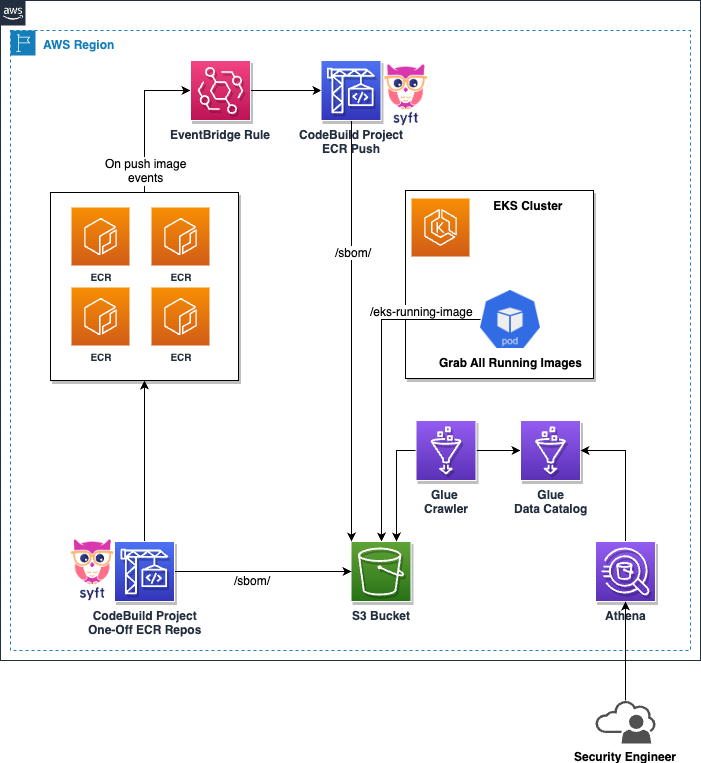
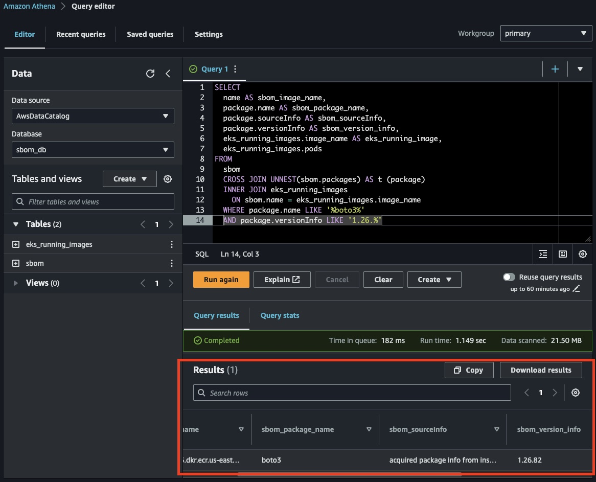

# Using SBOM to find vulnerable container images running on Amazon EKS clusters
This repository contains Terraform code and artifacts for a solution to generate Software Bill of Materials (SBOM) for container images in Amazon Elastic Container Registry (Amazon ECR) and analyze SBOM data using Amazon Athena to identify container images running on Amazon Elastic Kubernetes Service (Amazon EKS) clusters that contain vulnerable software components.

Please check the [Using SBOM to find vulnerable container images running on Amazon EKS clusters AWS Blogpost](https://aws.amazon.com/blogs/containers/using-sbom-to-find-vulnerable-container-images-running-on-amazon-eks-clusters/)

## Table of Contents
1. [Diagram](#diagram)
2. [Instructions](#instructions)
   1. [Deploy the solution architecture using Terraform](#deploy-the-solution-architecture-using-terraform)
   2. [Deploy the EKS cronjob](#deploy-the-eks-cronjob)
   3. [Populate the Glue catalog](#populate-the-glue-catalog)
3. [Run sample Athena Query](#run-sample-athena-query)
   1. [Vulnerability in a specific package - Search for specific package (without version)](#vulnerability-in-a-specific-package---search-for-specific-package-without-version) 
   2. [Vulnerability in specific package and version - Search for specific package and version](#vulnerability-in-specific-package-and-version---search-for-specific-package-and-version)
   3. [Vulnerability across multiple packages - Search for images with multiple packages installed  (Use IN array on SQL)](#vulnerability-across-multiple-packages---search-for-images-with-multiple-packages-installed--use-in-array-on-sql)

## Diagram


## Instructions

This section describes how to deploy the example architecture above which will use SBOM to find container images containing vulnerable software that are running on your EKS cluster. 
What we’ll do:

* Clone the GitHub repository and deploy the solution architecture using Terraform 
* Deploy a cronjob on EKS cluster to discover images for running containers
* Populate Glue catalog with with tables for SBOM and running images data
* Run Athena queries to find images found to be using vulnerable libraries and packages

### Deploy the solution architecture using Terraform

* First clone this [GitHub Repositoy](https://github.com/aws-samples/amazon-eks-use-sbom-to-find-container-image-with-vulnerable-software.git):

  * `git clone https://github.com/aws-samples/amazon-eks-use-sbom-to-find-container-image-with-vulnerable-software.git`

In the root directory of the Git Repository:

* Navigate to the terraform folder

  * `cd terraform`


* Edit `terraform.tfvars` file with any text editor of your choice. Make sure you provide the correct value for aws_region variable to specify the AWS region where you want to deploy. You can accept the defaults for other variables or change them if you wish to. The following variables are available to edit:
  * `aws_region` = AWS Region you want to deploy this solution (note that the default CLI AWS region might overwrite this variable)       
  * `ecr_repo_name` = Name of the ECR repository for the EKS container image to S3 solution
  * `codebuild_project_name` = CodeBuild name prefix for the SBOM solutions (event triggered and one-off solution)
  * `s3_bucket_name` = S3 Bucket prefix name (it'll add randmon char after this) for SBOM and EKS image files objects storage
  * `one_off_scan_repo_settings`  = Option to limit the "one-off" CodeBuild project to only scan specific provided ECR repositories. If you want this behaviour, please provide a list (with empty spaces in between) of all ECR repositories names. As an example, if you'd like to have `my-repo-1` and `my-repo-2` as the only ECR repositories names for the one-off solution to run. You'd set this variable as `one_off_scan_repo_settings  = my-repo-1 my-repo-2`. 

* Make sure the AWS IAM principal being used to run terraform has necessary privileges to deploy all resources. Refer to terraform documentation for providing AWS authentication credentials.
* Confirm you have configured the default region on your AWS CLI, run:

  * `aws configure list`

The recommended way to provide AWS credentials and default region is to use environment variables. For example, you can use AWS_PROFILE environment variable to provide the AWS CLI profile to use for running terraform. Refer to AWS CLI documentation for configuration details.

* By default, the sample solution will store terraform state file locally. If you want to use a remote backend like S3, configure AWS provider accordingly following terraform documentation.
* Initialize your working directory 

  * `terraform init `

* Preview the resources that terraform will deploy in your AWS account

   * `terraform plan`

* Deploy the resources. By running the following and selecting yes

  * `terraform apply`

* If you would like to run this as part of a gitlab pipeline as an example and you need to automatically approve the terraform apply. Run the following:

  * `terraform apply --auto-approve`

Terraform will output 2 values which you will need to copy for the next step of deploying cronjob on EKS.

### Deploy the EKS cronjob

We assume that you an existing EKS cluster and kubernetes CLI installed on your machine to interact with the cluster. The following steps describe how to deploy the cronjob described in solution overview section on your cluster

* Follow AWS documentation to create IAM OIDC provider for the cluster using eksctl
* Create IAM role for service account using eksctl. This IAM role will be used by the EKS cronjob to write the list of running container images to S3 bucket. Replace cluster name and policy ARN copied from the Terraform output.

  * `eksctl create iamserviceaccount --name image-discovery-job --namespace sbom-image-discovery --cluster <your EKS cluster name> --attach-policy-arn <policy ARN from Terraform output> --approve`


* Navigate to eks-image-discovery folder in the Git repo
* Terraform would have create an ECR repository in your account to store image of EKS cronjob. Go to ECR repository in AWS console and click on the button for view push commands. Follow those commands to build and push docker image of EKS cronjob to ECR repository. Copy the image URI of the newly pushed image from AWS console.
* Navigate to config folder inside eks-image-discovery. This contains a Kubernetes manifest file that you need to edit for deploying the cronjob. Open eks-image-discovery.yaml file in any text editor. 
    * Edit image field to change it to image URI that you copied in the previous step.
    * Update the name of S3 bucket in environment variable configuration. Use the bucket name copied from Terraform output
    * Update the name of EKS cluster in environment variable with your cluster name
    * Optionally update the cronjob schedule. By default, the job will run every 5 mins
* Apply the manifest file using kubectl.

  * `kubectl apply -f eks-image-discovery.yaml`


### Populate the Glue catalog

* Navigate to CodeBuild service in AWS console. Go to on off codebuild project and start a new build
* Verify that CodeBuild job finishes successfully.
* Navigate to S3 service in AWS console. Verify that CodeBuild job created SBOM files and EKS cronjob create list of running images file
* Navigate to Glue service in AWS console. Go to crawlers and run the sbom carwler.

### Run sample Athena Query

We will use Amazon Athena, a serverless query service that allows customers to analyze data stored in Amazon S3 using standard SQL. In this section, we will discuss some scenarios where customers may want to find out vulnerable software packages, and provide Athena queries that can be used to scan through the SBOM files.

To start querying your tables within the `sbom_db` database using Amazon Athena, follow these steps:

* Open the Amazon Athena console in your AWS Management Console.
* Confirm your data source is set to `AwsDataCatalog` - this should be the default selection.
* Next, locate and select the `sbom_db` database from the Database dropdown list, typically located on the left-hand side of the Query Editor.
* Before running your first query, configure your query result location by navigating to the Settings tab located at the top right corner of the console. Under 'Query result location', input or choose the desired Amazon S3 location where your query results will be stored. Remember to click 'Save' after setting the location. You can find more information on the Amazon Athena documentation about "Query results location".
* You can now return to the Query Editor and start writing and executing your queries on the `sbom_db` database.


Your Athena console should look something similar to the below screenshot:


Remember that Athena queries data directly from Amazon S3, so ensure your Athena service has the necessary permissions to access the designated S3 buckets.

Into the next sections, let's delve into the powerful querying capabilities of Amazon Athena applied to Software Bill of Materials (SBOMs). To facilitate a better understanding, we'll walk you through three practical examples:

* Find a container image(s) with a specific package: This will help you identify container images within your EKS cluster containing a particular package, regardless of its version.
* Identify container image(s) with a certain package and version: This extends the previous example, enabling you to pinpoint container images not just by a package, but also its specific version running in your EKS cluster.
* You can find few more Athena queries (SQL) examples at our GitHub repository. 

Remember, these examples merely scratch the surface. With Amazon Athena's robust SQL capabilities, you're encouraged to craft queries that fit your unique needs, leveraging the available SBOM data. This is not a limiting framework, but a jumping-off point to spark creativity and customization within your software supply chain management.


#### **Vulnerability in a specific package - Search for specific package (without version)** 

Identifying container images that contain vulnerable packages is essential to maintaining a secure container environment. By utilizing the query below, security and development teams can quickly pinpoint and address any security issues present in their EKS cluster. This particular query allows users to input a package name with a wildcard character (%) and retrieve a list of all container images on their EKS cluster that contain a package with the specified name.

Sample Query:

```
SELECT
  name AS sbom_image_name,
  package.name AS sbom_package_name,
  package.sourceInfo AS sbom_sourceInfo,
  package.versionInfo AS sbom_version_info,
  eks_running_images.image_name AS eks_running_image,
  eks_running_images.pods
FROM
  sbom
  CROSS JOIN UNNEST(sbom.packages) AS t (package)
  INNER JOIN eks_running_images
    ON sbom.name = eks_running_images.image_name
  WHERE package.name LIKE '%<PACKAGE_NAME>%'
```

Sample Output:
```
#    sbom_image_name    sbom_package_name    eks_running_image    pods    sbom_sourceInfo    sbom_version_info
1    <SBOM_CONTAINER_IMAGE_NAME>     <PACKAGE_NAME>   <EKS_RUNNING_CONTAINER_IMAGE>  <PODS_RUNNING_IMAGE>    <SBOM_SOURCE_INFORMATION>   <SBOM_PACKAGE_VERSION_INFO>
```

Sample Screenshot:


#### **Vulnerability in specific package and version - Search for specific package and version**

This sample query allows users to input a package name with a wildcard character (%) and retrieve a list of all container images on their EKS cluster that contain a package with the specified name. Copy the query from the example below, and replace the <PACKAGE_NAME> with a package name that you'd like to find out if any container image running on your EKS cluster exists (or not) in containers that you have generated the SBOM.

In our example, consider the deployed container "eks-image-discovery" in your EKS cluster, containing a package named "coreutils". To locate this package, you would append WHERE package.name LIKE '%coreutils%' to the end of your Athena query. This approach enhances the discoverability of any package within your ECR container images. The beauty of this solution is its utilization of SQL language, granting you flexibility to tailor your queries to your needs, based on the available SBOM and running EKS images. This makes it a powerful tool for understanding your software supply chain.

Sample Query:

```
SELECT
  name AS sbom_image_name,
  package.name AS sbom_package_name,
  package.sourceInfo AS sbom_sourceInfo,
  package.versionInfo AS sbom_version_info,
  eks_running_images.image_name AS eks_running_image,
  eks_running_images.pods
FROM
  sbom
  CROSS JOIN UNNEST(sbom.packages) AS t (package)
  INNER JOIN eks_running_images
    ON sbom.name = eks_running_images.image_name
  WHERE package.name LIKE '%<PACKAGE_NAME>%'
  AND package.versionInfo LIKE '<PACKAGE_VERSION>'
```

Incorporating SQL wildcards in your search for package versions can increase the flexibility of your query. For instance, if you need to find all versions that adhere to the format/version "v1.X", where X can be any value, you may utilize the following AND statement (as depicted in the last line above):

`AND package.versionInfo LIKE 'v1.%'`

Sample Output:
```
#    sbom_image_name    sbom_package_name    eks_running_image    pods    sbom_sourceInfo    sbom_version_info
1    <SBOM_CONTAINER_IMAGE_NAME>     <PACKAGE_NAME>   <EKS_RUNNING_CONTAINER_IMAGE>  <PODS_RUNNING_IMAGE>    <SBOM_SOURCE_INFORMATION>   <SBOM_PACKAGE_VERSION_INFO>
```

Sample Screenshot:



#### **Vulnerability across multiple packages - Search for images with multiple packages installed  (Use IN array on SQL)**

On occasion, users may need to search for multiple packages simultaneously, such as when a combination of packages creates a vulnerability or scenario that requires mitigation. This solution enables you to query for multiple package names across all the software bill of materials (SBOMs) generated from your container images. By searching for multiple packages at once, you can gain a more comprehensive view of your environment and identify any potential risks or issues. This approach can be particularly useful in large-scale deployments with complex software stacks.

Sample Query:
```
SELECT
  name AS sbom_image_name,
  package.name AS sbom_package_name,
  package.sourceInfo AS sbom_sourceInfo,
  package.versionInfo AS sbom_version_info,
  eks_running_images.image_name AS eks_running_image,
  eks_running_images.pods
FROM
  sbom
  CROSS JOIN UNNEST(sbom.packages) AS t (package)
  INNER JOIN eks_running_images
    ON sbom.name = eks_running_images.image_name
  WHERE package.name LIKE ('<PACCKAGE_NAME_1>') OR package.name LIKE ('<PACCKAGE_NAME_2>')
```

To match multiple packages simultaneously, you can include multiple OR statements in your query. Similarly, you can use wildcard characters in your LIKE statements to broaden your search, as demonstrated below:

`WHERE package.name LIKE ('<%PACCKAGE_NAME_1>%') OR package.name LIKE ('<%PACCKAGE_NAME_2%>')`


Sample Output:
```
#    sbom_image_name    sbom_package_name    eks_running_image    pods    sbom_sourceInfo    sbom_version_info
1    <SBOM_CONTAINER_IMAGE_NAME>     <PACKAGE_NAME>   <EKS_RUNNING_CONTAINER_IMAGE>  <PODS_RUNNING_IMAGE>    <SBOM_SOURCE_INFORMATION>   <SBOM_PACKAGE_VERSION_INFO>
```

Sample Screenshot:


## Cleaning up

To avoid incurring future charges, delete the resources created in the stack by running the following to approve automatically:

terraform destroy --auto-approve

 It should be noted that running the above command will destroy your entire terraform infrastructure without approval and so must be used with caution. The objects in the S3 buckets will not be deleted by this command unless it is explicitly stated in the code.


# License
This library is licensed under the MIT-0 License. See the LICENSE file.
